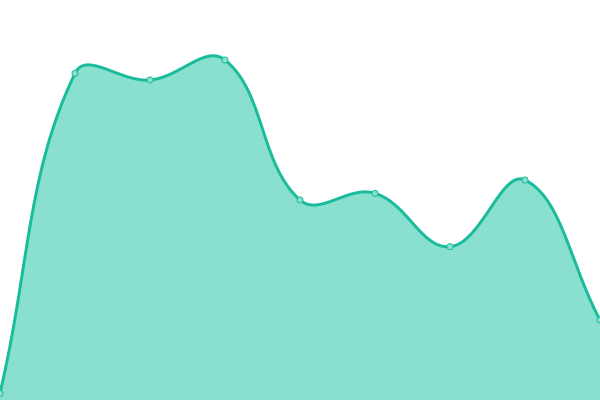
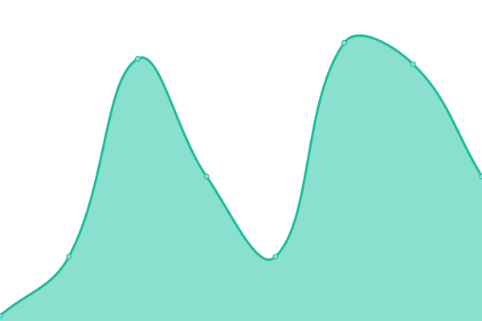
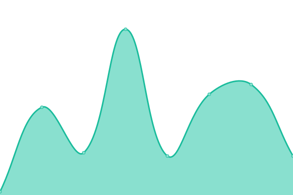
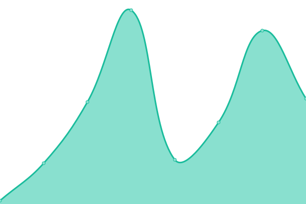
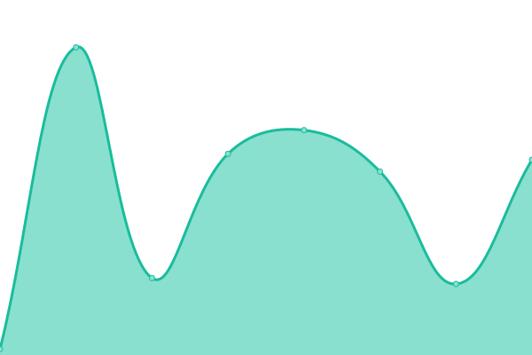
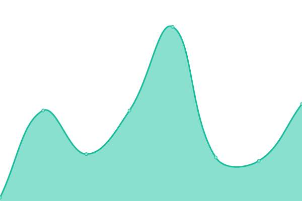

# [📈 Live Status](https://UniSynTechnologies.github.io/Upptime): <!--live status--> **🟧 Partial outage**

This repository contains the open-source uptime monitor and status page for [UniSyn Technologies](https:/unisyntechnologies.com), powered by [Upptime](https://github.com/upptime/upptime).

With [Upptime](https://upptime.js.org), you can get your own unlimited and free uptime monitor and status page, powered entirely by a GitHub repository. We use [Issues](https://github.com/UniSynTechnologies/Upptime/issues) as incident reports, [Actions](https://github.com/UniSynTechnologies/Upptime/actions) as uptime monitors, and [Pages](https://UniSynTechnologies.github.io/Upptime) for the status page.

<!--start: status pages-->
<!-- This summary is generated by Upptime (https://github.com/upptime/upptime) -->
<!-- Do not edit this manually, your changes will be overwritten -->
<!-- prettier-ignore -->
| URL | Status | History | Response Time | Uptime |
| --- | ------ | ------- | ------------- | ------ |
|  [UniSyn Webhost1](130.211.189.207) | 🟩 Up | [uni-syn-webhost1.yml](https://github.com/UniSynTechnologies/Upptime/commits/HEAD/history/uni-syn-webhost1.yml) | 

 34ms
     
 | 

<a href="https://status.unisyn.tech/history/uni-syn-webhost1">100.00%</a>
    

|  [UniSyn Webhost2](104.197.180.165) | 🟩 Up | [uni-syn-webhost2.yml](https://github.com/UniSynTechnologies/Upptime/commits/HEAD/history/uni-syn-webhost2.yml) | 

 34ms
     
 | 

<a href="https://status.unisyn.tech/history/uni-syn-webhost2">99.73%</a>
    

|  [UniSyn Webhost3](107.178.218.143) | 🟩 Up | [uni-syn-webhost3.yml](https://github.com/UniSynTechnologies/Upptime/commits/HEAD/history/uni-syn-webhost3.yml) | 

 34ms
     
 | 

<a href="https://status.unisyn.tech/history/uni-syn-webhost3">100.00%</a>
    

|  [UniSyn Webhost4](23.236.52.200) | 🟩 Up | [uni-syn-webhost4.yml](https://github.com/UniSynTechnologies/Upptime/commits/HEAD/history/uni-syn-webhost4.yml) | 

 34ms
     
 | 

<a href="https://status.unisyn.tech/history/uni-syn-webhost4">100.00%</a>
    

|  [UniSyn Webhost5](35.193.191.247) | 🟩 Up | [uni-syn-webhost5.yml](https://github.com/UniSynTechnologies/Upptime/commits/HEAD/history/uni-syn-webhost5.yml) | 

 34ms
     
 | 

<a href="https://status.unisyn.tech/history/uni-syn-webhost5">100.00%</a>
    

|  [UniSyn Webhost6](34.123.58.9) | 🟩 Up | [uni-syn-webhost6.yml](https://github.com/UniSynTechnologies/Upptime/commits/HEAD/history/uni-syn-webhost6.yml) | 

 34ms
     
 | 

<a href="https://status.unisyn.tech/history/uni-syn-webhost6">100.00%</a>
    

|  [UniSyn Webhost7](35.226.17.76) | 🟩 Up | [uni-syn-webhost7.yml](https://github.com/UniSynTechnologies/Upptime/commits/HEAD/history/uni-syn-webhost7.yml) | 

 34ms
     
 | 

<a href="https://status.unisyn.tech/history/uni-syn-webhost7">100.00%</a>
    

|  [UniSyn Webhost8](35.223.22.129) | 🟩 Up | [uni-syn-webhost8.yml](https://github.com/UniSynTechnologies/Upptime/commits/HEAD/history/uni-syn-webhost8.yml) | 

 34ms
     
 | 

<a href="https://status.unisyn.tech/history/uni-syn-webhost8">100.00%</a>
    

|  [UniSyn Webhost9](34.135.6.209) | 🟩 Up | [uni-syn-webhost9.yml](https://github.com/UniSynTechnologies/Upptime/commits/HEAD/history/uni-syn-webhost9.yml) | 

 34ms
     
 | 

<a href="https://status.unisyn.tech/history/uni-syn-webhost9">100.00%</a>
    

|  [UniSyn Webhost10](34.170.116.178) | 🟩 Up | [uni-syn-webhost10.yml](https://github.com/UniSynTechnologies/Upptime/commits/HEAD/history/uni-syn-webhost10.yml) | 

 34ms
     
 | 

<a href="https://status.unisyn.tech/history/uni-syn-webhost10">100.00%</a>
    

|  [UniSyn Open Hosting 1](34.16.44.80) | 🟩 Up | [uni-syn-open-hosting-1.yml](https://github.com/UniSynTechnologies/Upptime/commits/HEAD/history/uni-syn-open-hosting-1.yml) | 

 34ms
     
 | 

<a href="https://status.unisyn.tech/history/uni-syn-open-hosting-1">100.00%</a>
    

|  [UniSyn Open Hosting 2](104.197.128.162) | 🟥 Down | [uni-syn-open-hosting-2.yml](https://github.com/UniSynTechnologies/Upptime/commits/HEAD/history/uni-syn-open-hosting-2.yml) | 

 35ms
     
 | 

<a href="https://status.unisyn.tech/history/uni-syn-open-hosting-2">100.00%</a>
    

|  [UniSyn Open Hosting 3](104.197.146.59) | 🟩 Up | [uni-syn-open-hosting-3.yml](https://github.com/UniSynTechnologies/Upptime/commits/HEAD/history/uni-syn-open-hosting-3.yml) | 

 34ms
     
 | 

<a href="https://status.unisyn.tech/history/uni-syn-open-hosting-3">100.00%</a>
    

|  [UniSyn Webhost Budget 1](35.209.225.177) | 🟩 Up | [uni-syn-webhost-budget-1.yml](https://github.com/UniSynTechnologies/Upptime/commits/HEAD/history/uni-syn-webhost-budget-1.yml) | 

 44ms
     
 | 

<a href="https://status.unisyn.tech/history/uni-syn-webhost-budget-1">100.00%</a>
    

|  [UniSyn Worker1](35.188.154.239) | 🟩 Up | [uni-syn-worker1.yml](https://github.com/UniSynTechnologies/Upptime/commits/HEAD/history/uni-syn-worker1.yml) | 

 34ms
     
 | 

<a href="https://status.unisyn.tech/history/uni-syn-worker1">100.00%</a>
    

|  [Butter Book Production](34.72.50.113) | 🟩 Up | [butter-book-production.yml](https://github.com/UniSynTechnologies/Upptime/commits/HEAD/history/butter-book-production.yml) | 

 35ms
     
 | 

<a href="https://status.unisyn.tech/history/butter-book-production">100.00%</a>
    

|  [UniSyn Pcare](104.197.204.95) | 🟩 Up | [uni-syn-pcare.yml](https://github.com/UniSynTechnologies/Upptime/commits/HEAD/history/uni-syn-pcare.yml) | 

 35ms
     
 | 

<a href="https://status.unisyn.tech/history/uni-syn-pcare">100.00%</a>
    

<!--end: status pages-->

[**Visit our status website →**](https://UniSynTechnologies.github.io/Upptime)

## 📄 License

- Powered by: [Upptime](https://github.com/upptime/upptime)
- Code: [MIT](./LICENSE) © [Anand Chowdhary](https://anandchowdhary.com), supported by [Pabio](https://pabio.com)
- Data in the `./history` directory: [Open Database License](https://opendatacommons.org/licenses/odbl/1-0/)
