# [📈 Live Status](https://UniSynTechnologies.github.io/Upptime): <!--live status--> **🟧 Partial outage**

This repository contains the open-source uptime monitor and status page for [UniSyn Technologies](https:/unisyntechnologies.com), powered by [Upptime](https://github.com/upptime/upptime).

With [Upptime](https://upptime.js.org), you can get your own unlimited and free uptime monitor and status page, powered entirely by a GitHub repository. We use [Issues](https://github.com/UniSynTechnologies/Upptime/issues) as incident reports, [Actions](https://github.com/UniSynTechnologies/Upptime/actions) as uptime monitors, and [Pages](https://UniSynTechnologies.github.io/Upptime) for the status page.

<!--start: status pages-->
<!-- This summary is generated by Upptime (https://github.com/upptime/upptime) -->
<!-- Do not edit this manually, your changes will be overwritten -->
<!-- prettier-ignore -->
| URL | Status | History | Response Time | Uptime |
| --- | ------ | ------- | ------------- | ------ |
|  [UniSyn Home Page](https://www.unisyntechnologies.com) | 🟩 Up | [uni-syn-home-page.yml](https://github.com/UniSynTechnologies/Upptime/commits/HEAD/history/uni-syn-home-page.yml) | 

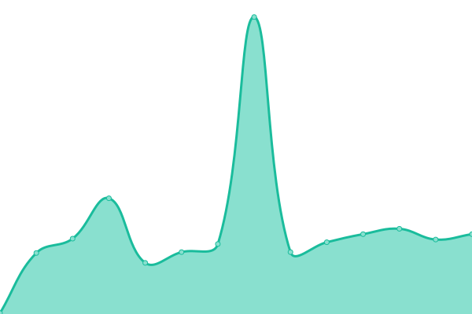 1195ms
     
 | 

<a href="https://UniSynTechnologies.github.io/Upptime/history/uni-syn-home-page">100.00%</a>
    

|  [3 Guys Concrete](http://3guysconcretellc.com) | 🟩 Up | [3-guys-concrete.yml](https://github.com/UniSynTechnologies/Upptime/commits/HEAD/history/3-guys-concrete.yml) | 

 2483ms
     
 | 

<a href="https://UniSynTechnologies.github.io/Upptime/history/3-guys-concrete">100.00%</a>
    

|  [A Hunt Design](https://www.ahuntdesign.com/) | 🟩 Up | [a-hunt-design.yml](https://github.com/UniSynTechnologies/Upptime/commits/HEAD/history/a-hunt-design.yml) | 

 3313ms
     
 | 

<a href="https://UniSynTechnologies.github.io/Upptime/history/a-hunt-design">100.00%</a>
    

|  [Butter Book](https://member.thebutterbook.com/) | 🟩 Up | [butter-book.yml](https://github.com/UniSynTechnologies/Upptime/commits/HEAD/history/butter-book.yml) | 

 1005ms
     
 | 

<a href="https://UniSynTechnologies.github.io/Upptime/history/butter-book">100.00%</a>
    

|  [Champaign County Environmental Stewards](https://www.ccenvstew.com/) | 🟩 Up | [champaign-county-environmental-stewards.yml](https://github.com/UniSynTechnologies/Upptime/commits/HEAD/history/champaign-county-environmental-stewards.yml) | 

 3999ms
     
 | 

<a href="https://UniSynTechnologies.github.io/Upptime/history/champaign-county-environmental-stewards">99.79%</a>
    

|  [Confidentially Yours](https://www.cybras.com/) | 🟩 Up | [confidentially-yours.yml](https://github.com/UniSynTechnologies/Upptime/commits/HEAD/history/confidentially-yours.yml) | 

 5267ms
     
 | 

<a href="https://UniSynTechnologies.github.io/Upptime/history/confidentially-yours">97.20%</a>
    

|  [Core40](https://www.core-40.com/) | 🟩 Up | [core40.yml](https://github.com/UniSynTechnologies/Upptime/commits/HEAD/history/core40.yml) | 

 2564ms
     
 | 

<a href="https://UniSynTechnologies.github.io/Upptime/history/core40">99.79%</a>
    

|  [CU flowerhouse](https://www.thecuflowerhouse.com/) | 🟩 Up | [cu-flowerhouse.yml](https://github.com/UniSynTechnologies/Upptime/commits/HEAD/history/cu-flowerhouse.yml) | 

 1215ms
     
 | 

<a href="https://UniSynTechnologies.github.io/Upptime/history/cu-flowerhouse">100.00%</a>
    

|  [Custom Flooring & Interior](https://www.customflooringinteriors.com/) | 🟩 Up | [custom-flooring-and-interior.yml](https://github.com/UniSynTechnologies/Upptime/commits/HEAD/history/custom-flooring-and-interior.yml) | 

 1519ms
     
 | 

<a href="https://UniSynTechnologies.github.io/Upptime/history/custom-flooring-and-interior">100.00%</a>
    

|  [D1 Networks](https://www.d1networks-inc.com/) | 🟩 Up | [d1-networks.yml](https://github.com/UniSynTechnologies/Upptime/commits/HEAD/history/d1-networks.yml) | 

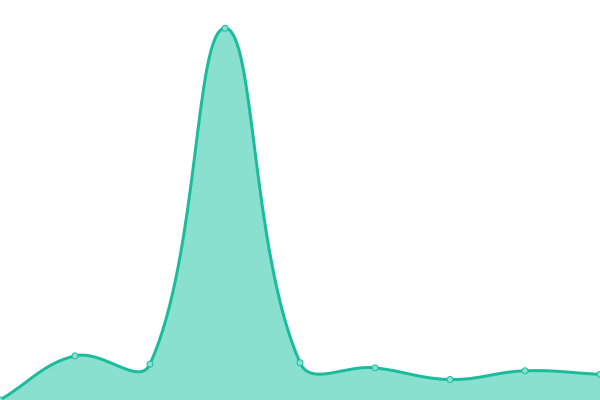 1087ms
     
 | 

<a href="https://UniSynTechnologies.github.io/Upptime/history/d1-networks">100.00%</a>
    

|  [Dr. G Brainworks](https://www.drgsbrainworks.com/) | 🟩 Up | [dr-g-brainworks.yml](https://github.com/UniSynTechnologies/Upptime/commits/HEAD/history/dr-g-brainworks.yml) | 

 1464ms
     
 | 

<a href="https://UniSynTechnologies.github.io/Upptime/history/dr-g-brainworks">100.00%</a>
    

|  [Elite ITC Services](https://www.elite-ict.com/) | 🟩 Up | [elite-itc-services.yml](https://github.com/UniSynTechnologies/Upptime/commits/HEAD/history/elite-itc-services.yml) | 

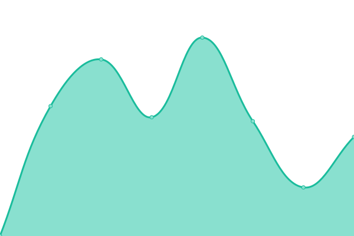 1082ms
     
 | 

<a href="https://UniSynTechnologies.github.io/Upptime/history/elite-itc-services">100.00%</a>
    

|  [Elmhurst Chicago Stone](https://www.ecstone.com/) | 🟩 Up | [elmhurst-chicago-stone.yml](https://github.com/UniSynTechnologies/Upptime/commits/HEAD/history/elmhurst-chicago-stone.yml) | 

 1975ms
     
 | 

<a href="https://UniSynTechnologies.github.io/Upptime/history/elmhurst-chicago-stone">100.00%</a>
    

|  [Evergreen Senior Living](https://evergreenslc.com/) | 🟩 Up | [evergreen-senior-living.yml](https://github.com/UniSynTechnologies/Upptime/commits/HEAD/history/evergreen-senior-living.yml) | 

 532ms
     
 | 

<a href="https://UniSynTechnologies.github.io/Upptime/history/evergreen-senior-living">100.00%</a>
    

|  [Fairwood Sustainability](https://www.fairwoodsustainability.com/) | 🟩 Up | [fairwood-sustainability.yml](https://github.com/UniSynTechnologies/Upptime/commits/HEAD/history/fairwood-sustainability.yml) | 

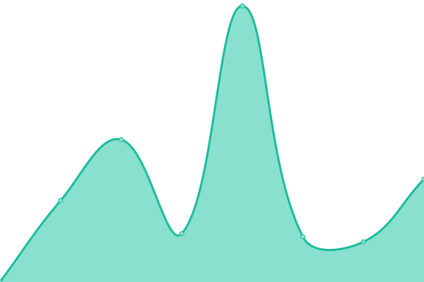 1294ms
     
 | 

<a href="https://UniSynTechnologies.github.io/Upptime/history/fairwood-sustainability">100.00%</a>
    

|  [Farm Link](https://www.illinoisfarmlink.org/) | 🟩 Up | [farm-link.yml](https://github.com/UniSynTechnologies/Upptime/commits/HEAD/history/farm-link.yml) | 

 2265ms
     
 | 

<a href="https://UniSynTechnologies.github.io/Upptime/history/farm-link">100.00%</a>
    

|  [Flowfeed App](https://nwa.flowfeed.app) | 🟩 Up | [flowfeed-app.yml](https://github.com/UniSynTechnologies/Upptime/commits/HEAD/history/flowfeed-app.yml) | 

 192ms
     
 | 

<a href="https://UniSynTechnologies.github.io/Upptime/history/flowfeed-app">100.00%</a>
    

|  [FocusOPEX](https://www.focusopex.com/) | 🟩 Up | [focus-opex.yml](https://github.com/UniSynTechnologies/Upptime/commits/HEAD/history/focus-opex.yml) | 

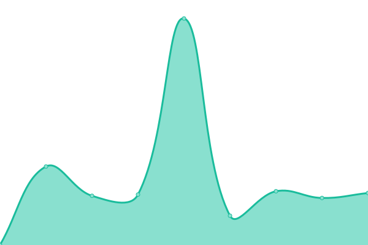 1673ms
     
 | 

<a href="https://UniSynTechnologies.github.io/Upptime/history/focus-opex">99.80%</a>
    

|  [Green Tree Pharmacy](https://greentreepharm.com/) | 🟩 Up | [green-tree-pharmacy.yml](https://github.com/UniSynTechnologies/Upptime/commits/HEAD/history/green-tree-pharmacy.yml) | 

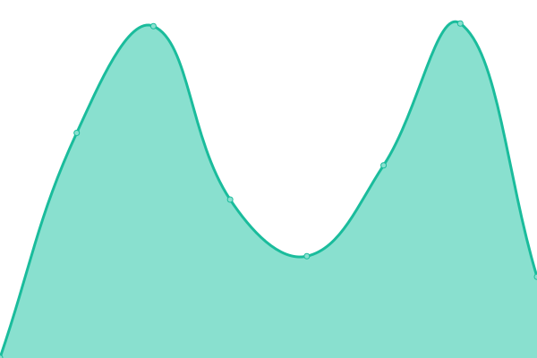 990ms
     
 | 

<a href="https://UniSynTechnologies.github.io/Upptime/history/green-tree-pharmacy">100.00%</a>
    

|  [H2 Cartage](https://www.h2cartage.com/) | 🟩 Up | [h2-cartage.yml](https://github.com/UniSynTechnologies/Upptime/commits/HEAD/history/h2-cartage.yml) | 

 2138ms
     
 | 

<a href="https://UniSynTechnologies.github.io/Upptime/history/h2-cartage">100.00%</a>
    

|  [Heritage Operations Group](https://heritageofcare.com/) | 🟩 Up | [heritage-operations-group.yml](https://github.com/UniSynTechnologies/Upptime/commits/HEAD/history/heritage-operations-group.yml) | 

 641ms
     
 | 

<a href="https://UniSynTechnologies.github.io/Upptime/history/heritage-operations-group">100.00%</a>
    

|  [Heritage Operations Group Employee Portal](https://employeeofheritage.com/) | 🟩 Up | [heritage-operations-group-employee-portal.yml](https://github.com/UniSynTechnologies/Upptime/commits/HEAD/history/heritage-operations-group-employee-portal.yml) | 

 2313ms
     
 | 

<a href="https://UniSynTechnologies.github.io/Upptime/history/heritage-operations-group-employee-portal">100.00%</a>
    

|  [Illinois Lets Rock](https://www.letsrockillinois.com/) | 🟩 Up | [illinois-lets-rock.yml](https://github.com/UniSynTechnologies/Upptime/commits/HEAD/history/illinois-lets-rock.yml) | 

 1146ms
     
 | 

<a href="https://UniSynTechnologies.github.io/Upptime/history/illinois-lets-rock">100.00%</a>
    

|  [ILFMA](https://www.ilfma.org/) | 🟩 Up | [ilfma.yml](https://github.com/UniSynTechnologies/Upptime/commits/HEAD/history/ilfma.yml) | 

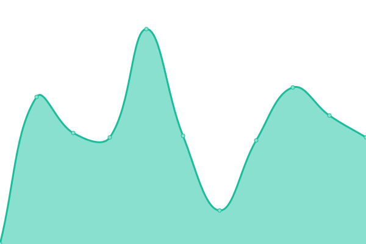 2103ms
     
 | 

<a href="https://UniSynTechnologies.github.io/Upptime/history/ilfma">99.80%</a>
    

|  [Illinois Asphalt Pavement Association](https://www.rethinkasphalt.com/) | 🟩 Up | [illinois-asphalt-pavement-association.yml](https://github.com/UniSynTechnologies/Upptime/commits/HEAD/history/illinois-asphalt-pavement-association.yml) | 

 2093ms
     
 | 

<a href="https://UniSynTechnologies.github.io/Upptime/history/illinois-asphalt-pavement-association">100.00%</a>
    

|  [Inspire Your](https://www.inspireyour.com/) | 🟩 Up | [inspire-your.yml](https://github.com/UniSynTechnologies/Upptime/commits/HEAD/history/inspire-your.yml) | 

 3677ms
     
 | 

<a href="https://UniSynTechnologies.github.io/Upptime/history/inspire-your">98.98%</a>
    

|  [Iowa - Lets Rock](https://www.letsrockiowa.com/) | 🟩 Up | [iowa-lets-rock.yml](https://github.com/UniSynTechnologies/Upptime/commits/HEAD/history/iowa-lets-rock.yml) | 

 2255ms
     
 | 

<a href="https://UniSynTechnologies.github.io/Upptime/history/iowa-lets-rock">100.00%</a>
    

|  [KeepUsSafe](https://www.keepussafe.app/) | 🟩 Up | [keep-us-safe.yml](https://github.com/UniSynTechnologies/Upptime/commits/HEAD/history/keep-us-safe.yml) | 

 1282ms
     
 | 

<a href="https://UniSynTechnologies.github.io/Upptime/history/keep-us-safe">99.84%</a>
    

|  [KleenRite](https://www.kleenrite.net) | 🟩 Up | [kleen-rite.yml](https://github.com/UniSynTechnologies/Upptime/commits/HEAD/history/kleen-rite.yml) | 

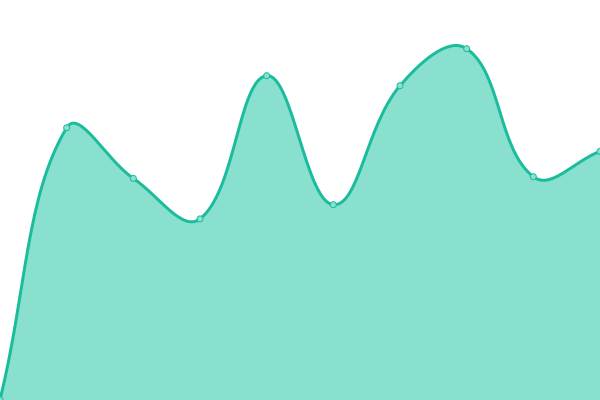 2809ms
     
 | 

<a href="https://UniSynTechnologies.github.io/Upptime/history/kleen-rite">99.80%</a>
    

|  [Land Connection](https://www.thelandconnection.org/) | 🟩 Up | [land-connection.yml](https://github.com/UniSynTechnologies/Upptime/commits/HEAD/history/land-connection.yml) | 

 667ms
     
 | 

<a href="https://UniSynTechnologies.github.io/Upptime/history/land-connection">100.00%</a>
    

|  [Lets Rock Minnesota](https://www.letsrockminnesota.com) | 🟩 Up | [lets-rock-minnesota.yml](https://github.com/UniSynTechnologies/Upptime/commits/HEAD/history/lets-rock-minnesota.yml) | 

 1464ms
     
 | 

<a href="https://UniSynTechnologies.github.io/Upptime/history/lets-rock-minnesota">100.00%</a>
    

|  [Lets Rock Missouri](https://www.letsrockmissouri.com/) | 🟩 Up | [lets-rock-missouri.yml](https://github.com/UniSynTechnologies/Upptime/commits/HEAD/history/lets-rock-missouri.yml) | 

 2419ms
     
 | 

<a href="https://UniSynTechnologies.github.io/Upptime/history/lets-rock-missouri">100.00%</a>
    

|  [Orland Park](https://evergreenslc.com/orlandpark) | 🟩 Up | [orland-park.yml](https://github.com/UniSynTechnologies/Upptime/commits/HEAD/history/orland-park.yml) | 

 765ms
     
 | 

<a href="https://UniSynTechnologies.github.io/Upptime/history/orland-park">100.00%</a>
    

|  [Pan & Cake Catering Co](https://www.panandcakecatering.com/) | 🟩 Up | [pan-and-cake-catering-co.yml](https://github.com/UniSynTechnologies/Upptime/commits/HEAD/history/pan-and-cake-catering-co.yml) | 

 2994ms
     
 | 

<a href="https://UniSynTechnologies.github.io/Upptime/history/pan-and-cake-catering-co">98.99%</a>
    

|  [Parke Warehouses](https://www.parkewarehouses.com/) | 🟩 Up | [parke-warehouses.yml](https://github.com/UniSynTechnologies/Upptime/commits/HEAD/history/parke-warehouses.yml) | 

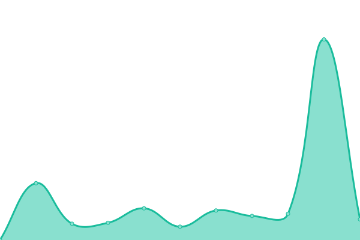 1386ms
     
 | 

<a href="https://UniSynTechnologies.github.io/Upptime/history/parke-warehouses">100.00%</a>
    

|  [Photonicare](https://photoni.care) | 🟥 Down | [photonicare.yml](https://github.com/UniSynTechnologies/Upptime/commits/HEAD/history/photonicare.yml) | 

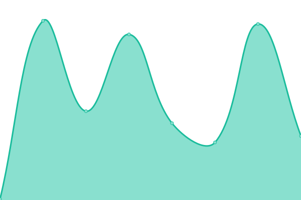 2611ms
     
 | 

<a href="https://UniSynTechnologies.github.io/Upptime/history/photonicare">76.06%</a>
    

|  [Sage City Market](https://www.sagecitymarket.com) | 🟩 Up | [sage-city-market.yml](https://github.com/UniSynTechnologies/Upptime/commits/HEAD/history/sage-city-market.yml) | 

 5422ms
     
 | 

<a href="https://UniSynTechnologies.github.io/Upptime/history/sage-city-market">99.25%</a>
    

|  [Salon House](https://www.thesalonhouse.com/) | 🟩 Up | [salon-house.yml](https://github.com/UniSynTechnologies/Upptime/commits/HEAD/history/salon-house.yml) | 

 2530ms
     
 | 

<a href="https://UniSynTechnologies.github.io/Upptime/history/salon-house">100.00%</a>
    

|  [Stone Face Manor](https://www.stonefacemanor.com/) | 🟩 Up | [stone-face-manor.yml](https://github.com/UniSynTechnologies/Upptime/commits/HEAD/history/stone-face-manor.yml) | 

 1309ms
     
 | 

<a href="https://UniSynTechnologies.github.io/Upptime/history/stone-face-manor">100.00%</a>
    

|  [Taylor Construction](http://buildwithtaylor.com) | 🟩 Up | [taylor-construction.yml](https://github.com/UniSynTechnologies/Upptime/commits/HEAD/history/taylor-construction.yml) | 

 2339ms
     
 | 

<a href="https://UniSynTechnologies.github.io/Upptime/history/taylor-construction">100.00%</a>
    

|  [Tuscola Community Foundation](https://www.tuscolafoundation.org/) | 🟩 Up | [tuscola-community-foundation.yml](https://github.com/UniSynTechnologies/Upptime/commits/HEAD/history/tuscola-community-foundation.yml) | 

 999ms
     
 | 

<a href="https://UniSynTechnologies.github.io/Upptime/history/tuscola-community-foundation">100.00%</a>
    

|  [Urbana Parks Foundation](https://www.urbanaparksfoundation.org/) | 🟩 Up | [urbana-parks-foundation.yml](https://github.com/UniSynTechnologies/Upptime/commits/HEAD/history/urbana-parks-foundation.yml) | 

 1264ms
     
 | 

<a href="https://UniSynTechnologies.github.io/Upptime/history/urbana-parks-foundation">100.00%</a>
    

|  [Villas Senior Care Community](https://villasseniorcare.com/) | 🟩 Up | [villas-senior-care-community.yml](https://github.com/UniSynTechnologies/Upptime/commits/HEAD/history/villas-senior-care-community.yml) | 

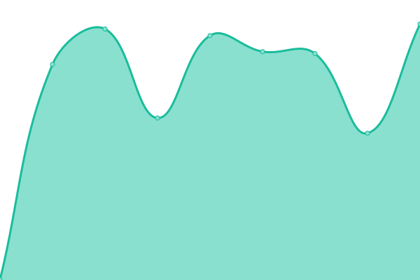 1058ms
     
 | 

<a href="https://UniSynTechnologies.github.io/Upptime/history/villas-senior-care-community">100.00%</a>
    

|  [Worksource](https://www.workse.org) | 🟩 Up | [worksource.yml](https://github.com/UniSynTechnologies/Upptime/commits/HEAD/history/worksource.yml) | 

 1617ms
     
 | 

<a href="https://UniSynTechnologies.github.io/Upptime/history/worksource">100.00%</a>
    

<!--end: status pages-->

[**Visit our status website →**](https://UniSynTechnologies.github.io/Upptime)

## 📄 License

- Powered by: [Upptime](https://github.com/upptime/upptime)
- Code: [MIT](./LICENSE) © [Anand Chowdhary](https://anandchowdhary.com), supported by [Pabio](https://pabio.com)
- Data in the `./history` directory: [Open Database License](https://opendatacommons.org/licenses/odbl/1-0/)
