# [📈 Live Status](https://UniSynTechnologies.github.io/Upptime): <!--live status--> **🟧 Partial outage**

This repository contains the open-source uptime monitor and status page for [UniSyn Technologies](https:/unisyntechnologies.com), powered by [Upptime](https://github.com/upptime/upptime).

With [Upptime](https://upptime.js.org), you can get your own unlimited and free uptime monitor and status page, powered entirely by a GitHub repository. We use [Issues](https://github.com/UniSynTechnologies/Upptime/issues) as incident reports, [Actions](https://github.com/UniSynTechnologies/Upptime/actions) as uptime monitors, and [Pages](https://UniSynTechnologies.github.io/Upptime) for the status page.

<!--start: status pages-->
<!-- This summary is generated by Upptime (https://github.com/upptime/upptime) -->
<!-- Do not edit this manually, your changes will be overwritten -->
<!-- prettier-ignore -->
| URL | Status | History | Response Time | Uptime |
| --- | ------ | ------- | ------------- | ------ |
|  [UniSyn Webhost1](130.211.189.207) | 🟩 Up | [uni-syn-webhost1.yml](https://github.com/UniSynTechnologies/Upptime/commits/HEAD/history/uni-syn-webhost1.yml) | 

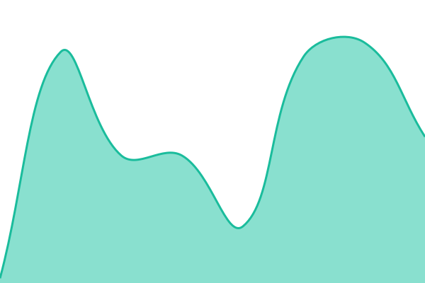 39ms
     
 | 

<a href="https://status.unisyn.tech/history/uni-syn-webhost1">100.00%</a>
    

|  [UniSyn Webhost2](104.197.180.165) | 🟩 Up | [uni-syn-webhost2.yml](https://github.com/UniSynTechnologies/Upptime/commits/HEAD/history/uni-syn-webhost2.yml) | 

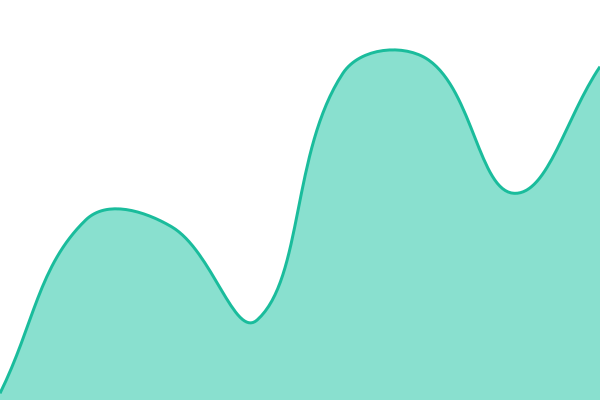 39ms
     
 | 

<a href="https://status.unisyn.tech/history/uni-syn-webhost2">100.00%</a>
    

|  [UniSyn Webhost3](107.178.218.143) | 🟩 Up | [uni-syn-webhost3.yml](https://github.com/UniSynTechnologies/Upptime/commits/HEAD/history/uni-syn-webhost3.yml) | 

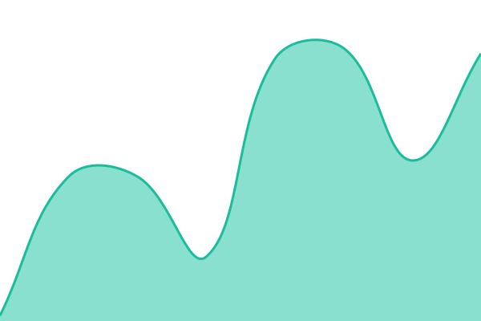 39ms
     
 | 

<a href="https://status.unisyn.tech/history/uni-syn-webhost3">100.00%</a>
    

|  [UniSyn Webhost4](23.236.52.200) | 🟩 Up | [uni-syn-webhost4.yml](https://github.com/UniSynTechnologies/Upptime/commits/HEAD/history/uni-syn-webhost4.yml) | 

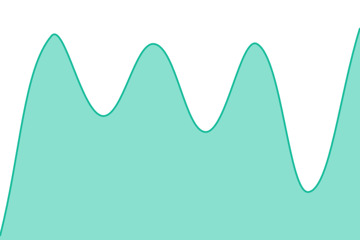 40ms
     
 | 

<a href="https://status.unisyn.tech/history/uni-syn-webhost4">100.00%</a>
    

|  [UniSyn Webhost5](35.193.191.247) | 🟩 Up | [uni-syn-webhost5.yml](https://github.com/UniSynTechnologies/Upptime/commits/HEAD/history/uni-syn-webhost5.yml) | 

 39ms
     
 | 

<a href="https://status.unisyn.tech/history/uni-syn-webhost5">100.00%</a>
    

|  [UniSyn Webhost6](34.123.58.9) | 🟩 Up | [uni-syn-webhost6.yml](https://github.com/UniSynTechnologies/Upptime/commits/HEAD/history/uni-syn-webhost6.yml) | 

 39ms
     
 | 

<a href="https://status.unisyn.tech/history/uni-syn-webhost6">100.00%</a>
    

|  [UniSyn Webhost7](35.226.17.76) | 🟩 Up | [uni-syn-webhost7.yml](https://github.com/UniSynTechnologies/Upptime/commits/HEAD/history/uni-syn-webhost7.yml) | 

 39ms
     
 | 

<a href="https://status.unisyn.tech/history/uni-syn-webhost7">100.00%</a>
    

|  [UniSyn Webhost8](35.223.22.129) | 🟩 Up | [uni-syn-webhost8.yml](https://github.com/UniSynTechnologies/Upptime/commits/HEAD/history/uni-syn-webhost8.yml) | 

 39ms
     
 | 

<a href="https://status.unisyn.tech/history/uni-syn-webhost8">100.00%</a>
    

|  [UniSyn Webhost9](34.135.6.209) | 🟩 Up | [uni-syn-webhost9.yml](https://github.com/UniSynTechnologies/Upptime/commits/HEAD/history/uni-syn-webhost9.yml) | 

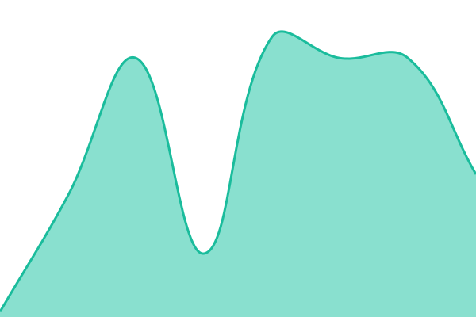 39ms
     
 | 

<a href="https://status.unisyn.tech/history/uni-syn-webhost9">100.00%</a>
    

|  [UniSyn Open Hosting 1](34.16.44.80) | 🟩 Up | [uni-syn-open-hosting-1.yml](https://github.com/UniSynTechnologies/Upptime/commits/HEAD/history/uni-syn-open-hosting-1.yml) | 

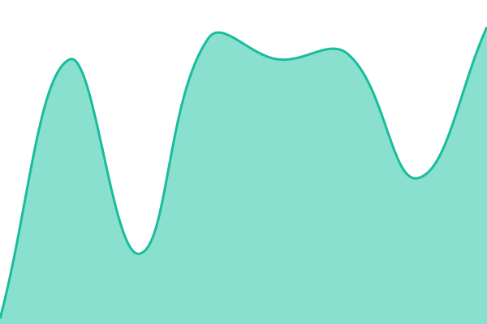 39ms
     
 | 

<a href="https://status.unisyn.tech/history/uni-syn-open-hosting-1">100.00%</a>
    

|  [UniSyn Open Hosting 2](104.197.128.162) | 🟩 Up | [uni-syn-open-hosting-2.yml](https://github.com/UniSynTechnologies/Upptime/commits/HEAD/history/uni-syn-open-hosting-2.yml) | 

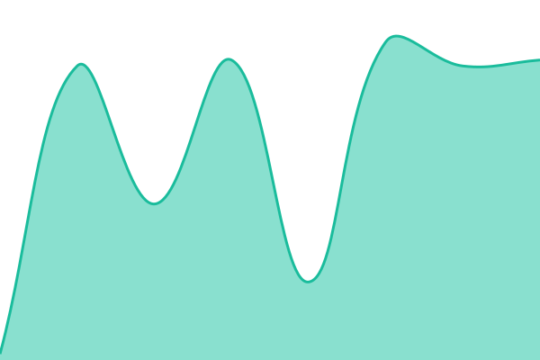 41ms
     
 | 

<a href="https://status.unisyn.tech/history/uni-syn-open-hosting-2">99.70%</a>
    

|  [UniSyn Open Hosting 3](104.197.146.59) | 🟩 Up | [uni-syn-open-hosting-3.yml](https://github.com/UniSynTechnologies/Upptime/commits/HEAD/history/uni-syn-open-hosting-3.yml) | 

 39ms
     
 | 

<a href="https://status.unisyn.tech/history/uni-syn-open-hosting-3">100.00%</a>
    

|  [UniSyn Worker1](35.188.154.239) | 🟩 Up | [uni-syn-worker1.yml](https://github.com/UniSynTechnologies/Upptime/commits/HEAD/history/uni-syn-worker1.yml) | 

 39ms
     
 | 

<a href="https://status.unisyn.tech/history/uni-syn-worker1">100.00%</a>
    

|  [Butter Book Production](34.72.50.113) | 🟩 Up | [butter-book-production.yml](https://github.com/UniSynTechnologies/Upptime/commits/HEAD/history/butter-book-production.yml) | 

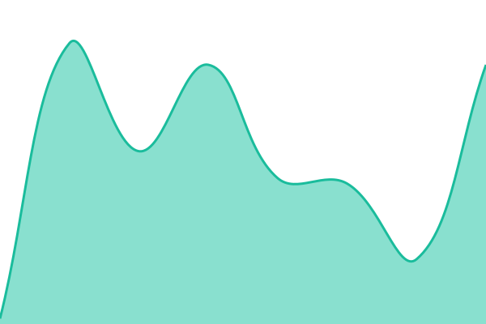 39ms
     
 | 

<a href="https://status.unisyn.tech/history/butter-book-production">100.00%</a>
    

|  [UniSyn Pcare](104.197.204.95) | 🟩 Up | [uni-syn-pcare.yml](https://github.com/UniSynTechnologies/Upptime/commits/HEAD/history/uni-syn-pcare.yml) | 

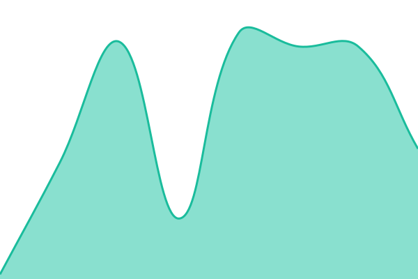 39ms
     
 | 

<a href="https://status.unisyn.tech/history/uni-syn-pcare">100.00%</a>
    

|  [Custom Flooring Interior](https://www.customflooringinterior.com) | 🟩 Up | [custom-flooring-interior.yml](https://github.com/UniSynTechnologies/Upptime/commits/HEAD/history/custom-flooring-interior.yml) | 

 1994ms
     
 | 

<a href="https://status.unisyn.tech/history/custom-flooring-interior">100.00%</a>
    

|  [D1 Networks](https://www.d1networks-inc.com) | 🟩 Up | [d1-networks.yml](https://github.com/UniSynTechnologies/Upptime/commits/HEAD/history/d1-networks.yml) | 

 1049ms
     
 | 

<a href="https://status.unisyn.tech/history/d1-networks">100.00%</a>
    

|  [Elite ICT](https://www.elite-ict.com) | 🟩 Up | [elite-ict.yml](https://github.com/UniSynTechnologies/Upptime/commits/HEAD/history/elite-ict.yml) | 

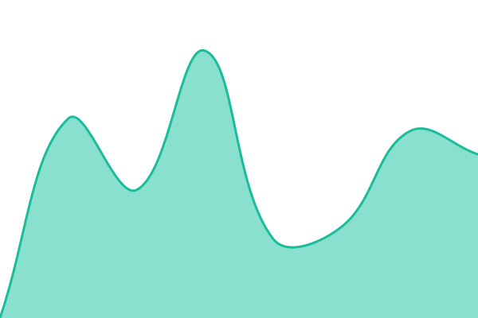 775ms
     
 | 

<a href="https://status.unisyn.tech/history/elite-ict">100.00%</a>
    

|  [The Salon House](https://www.thesalonhouse.com) | 🟩 Up | [the-salon-house.yml](https://github.com/UniSynTechnologies/Upptime/commits/HEAD/history/the-salon-house.yml) | 

 1368ms
     
 | 

<a href="https://status.unisyn.tech/history/the-salon-house">100.00%</a>
    

|  [Illinois Farmlink](https://www.illinoisfarmlink.org) | 🟩 Up | [illinois-farmlink.yml](https://github.com/UniSynTechnologies/Upptime/commits/HEAD/history/illinois-farmlink.yml) | 

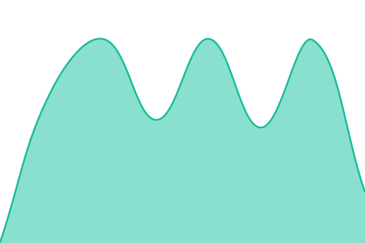 321ms
     
 | 

<a href="https://status.unisyn.tech/history/illinois-farmlink">100.00%</a>
    

|  [Let's Rock Iowa](https://www.letsrockiowa.com) | 🟩 Up | [let-s-rock-iowa.yml](https://github.com/UniSynTechnologies/Upptime/commits/HEAD/history/let-s-rock-iowa.yml) | 

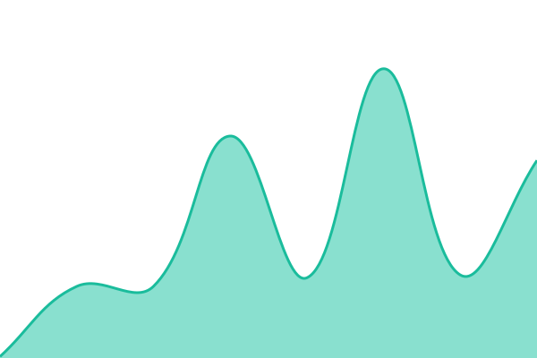 75ms
     
 | 

<a href="https://status.unisyn.tech/history/let-s-rock-iowa">100.00%</a>
    

|  [Urbana Parks Foundation](https://www.urbanaparksfoundation.org) | 🟩 Up | [urbana-parks-foundation.yml](https://github.com/UniSynTechnologies/Upptime/commits/HEAD/history/urbana-parks-foundation.yml) | 

 1154ms
     
 | 

<a href="https://status.unisyn.tech/history/urbana-parks-foundation">100.00%</a>
    

|  [CC Environmental Stewardship](https://www.ccenvstew.org) | 🟩 Up | [cc-environmental-stewardship.yml](https://github.com/UniSynTechnologies/Upptime/commits/HEAD/history/cc-environmental-stewardship.yml) | 

 1057ms
     
 | 

<a href="https://status.unisyn.tech/history/cc-environmental-stewardship">100.00%</a>
    

|  [ILFMA](https://www.ilfma.org) | 🟩 Up | [ilfma.yml](https://github.com/UniSynTechnologies/Upptime/commits/HEAD/history/ilfma.yml) | 

 2049ms
     
 | 

<a href="https://status.unisyn.tech/history/ilfma">100.00%</a>
    

|  [Kleenrite](https://www.kleenrite.net) | 🟩 Up | [kleenrite.yml](https://github.com/UniSynTechnologies/Upptime/commits/HEAD/history/kleenrite.yml) | 

 2518ms
     
 | 

<a href="https://status.unisyn.tech/history/kleenrite">100.00%</a>
    

|  [Build With Taylor](https://www.buildwithtaylor.com) | 🟩 Up | [build-with-taylor.yml](https://github.com/UniSynTechnologies/Upptime/commits/HEAD/history/build-with-taylor.yml) | 

 122ms
     
 | 

<a href="https://status.unisyn.tech/history/build-with-taylor">100.00%</a>
    

|  [Let's Rock Minnesota](https://www.letsrockminnesota.com) | 🟥 Down | [let-s-rock-minnesota.yml](https://github.com/UniSynTechnologies/Upptime/commits/HEAD/history/let-s-rock-minnesota.yml) | 

 97ms
     
 | 

<a href="https://status.unisyn.tech/history/let-s-rock-minnesota">99.98%</a>
    

|  [Stoneface Manor](https://www.stonefacemanor.com) | 🟩 Up | [stoneface-manor.yml](https://github.com/UniSynTechnologies/Upptime/commits/HEAD/history/stoneface-manor.yml) | 

 98ms
     
 | 

<a href="https://status.unisyn.tech/history/stoneface-manor">100.00%</a>
    

|  [Core-40](https://www.core-40.com) | 🟩 Up | [core-40.yml](https://github.com/UniSynTechnologies/Upptime/commits/HEAD/history/core-40.yml) | 

 2117ms
     
 | 

<a href="https://status.unisyn.tech/history/core-40">100.00%</a>
    

|  [Ecstone](https://www.ecstone.com) | 🟩 Up | [ecstone.yml](https://github.com/UniSynTechnologies/Upptime/commits/HEAD/history/ecstone.yml) | 

 1676ms
     
 | 

<a href="https://status.unisyn.tech/history/ecstone">100.00%</a>
    

|  [H2 Cartage](https://www.h2cartage.com) | 🟩 Up | [h2-cartage.yml](https://github.com/UniSynTechnologies/Upptime/commits/HEAD/history/h2-cartage.yml) | 

 1945ms
     
 | 

<a href="https://status.unisyn.tech/history/h2-cartage">100.00%</a>
    

|  [The Land Connection](https://www.thelandconnection.org) | 🟩 Up | [the-land-connection.yml](https://github.com/UniSynTechnologies/Upptime/commits/HEAD/history/the-land-connection.yml) | 

 95ms
     
 | 

<a href="https://status.unisyn.tech/history/the-land-connection">100.00%</a>
    

|  [Let's Rock Missouri](https://www.letsrockmissouri.com) | 🟩 Up | [let-s-rock-missouri.yml](https://github.com/UniSynTechnologies/Upptime/commits/HEAD/history/let-s-rock-missouri.yml) | 

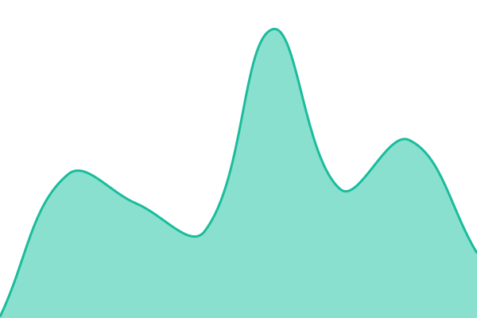 122ms
     
 | 

<a href="https://status.unisyn.tech/history/let-s-rock-missouri">100.00%</a>
    

|  [Rethink Asphalt](https://www.rethinkasphalt.com) | 🟩 Up | [rethink-asphalt.yml](https://github.com/UniSynTechnologies/Upptime/commits/HEAD/history/rethink-asphalt.yml) | 

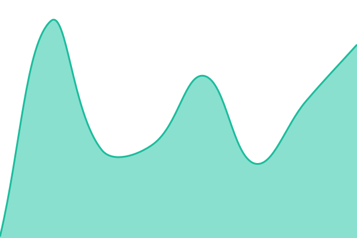 97ms
     
 | 

<a href="https://status.unisyn.tech/history/rethink-asphalt">100.00%</a>
    

|  [WorkSE](https://www.workse.org) | 🟩 Up | [work-se.yml](https://github.com/UniSynTechnologies/Upptime/commits/HEAD/history/work-se.yml) | 

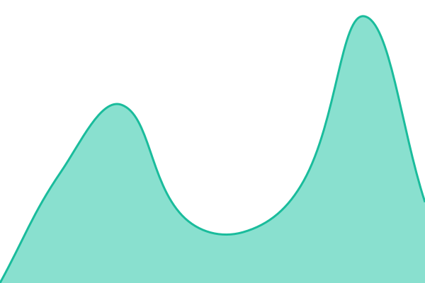 2355ms
     
 | 

<a href="https://status.unisyn.tech/history/work-se">100.00%</a>
    

|  [QCB Illinois](https://qcb.illinois.edu) | 🟩 Up | [qcb-illinois.yml](https://github.com/UniSynTechnologies/Upptime/commits/HEAD/history/qcb-illinois.yml) | 

 2106ms
     
 | 

<a href="https://status.unisyn.tech/history/qcb-illinois">100.00%</a>
    

|  [Sage City Market](https://www.sagecitymarket.com) | 🟩 Up | [sage-city-market.yml](https://github.com/UniSynTechnologies/Upptime/commits/HEAD/history/sage-city-market.yml) | 

 3175ms
     
 | 

<a href="https://status.unisyn.tech/history/sage-city-market">100.00%</a>
    

|  [Let's Rock Illinois](https://www.letsrockillinois.com) | 🟩 Up | [let-s-rock-illinois.yml](https://github.com/UniSynTechnologies/Upptime/commits/HEAD/history/let-s-rock-illinois.yml) | 

 246ms
     
 | 

<a href="https://status.unisyn.tech/history/let-s-rock-illinois">100.00%</a>
    

|  [Parke Warehouses](https://www.parkewarehouses.com) | 🟩 Up | [parke-warehouses.yml](https://github.com/UniSynTechnologies/Upptime/commits/HEAD/history/parke-warehouses.yml) | 

 1320ms
     
 | 

<a href="https://status.unisyn.tech/history/parke-warehouses">100.00%</a>
    

|  [Tuscola Foundation](https://www.tuscolafoundation.org) | 🟩 Up | [tuscola-foundation.yml](https://github.com/UniSynTechnologies/Upptime/commits/HEAD/history/tuscola-foundation.yml) | 

 664ms
     
 | 

<a href="https://status.unisyn.tech/history/tuscola-foundation">100.00%</a>
    

|  [Cybras](https://www.cybras.com) | 🟩 Up | [cybras.yml](https://github.com/UniSynTechnologies/Upptime/commits/HEAD/history/cybras.yml) | 

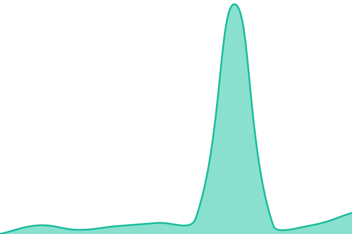 140ms
     
 | 

<a href="https://status.unisyn.tech/history/cybras">100.00%</a>
    

|  [Employee of Heritage](https://employeeofheritage.com) | 🟩 Up | [employee-of-heritage.yml](https://github.com/UniSynTechnologies/Upptime/commits/HEAD/history/employee-of-heritage.yml) | 

 2369ms
     
 | 

<a href="https://status.unisyn.tech/history/employee-of-heritage">100.00%</a>
    

|  [Evergreen SLC](https://evergreenslc.com) | 🟩 Up | [evergreen-slc.yml](https://github.com/UniSynTechnologies/Upptime/commits/HEAD/history/evergreen-slc.yml) | 

 1185ms
     
 | 

<a href="https://status.unisyn.tech/history/evergreen-slc">100.00%</a>
    

|  [Greentree Pharmacy](https://greentreepharmacy.com) | 🟩 Up | [greentree-pharmacy.yml](https://github.com/UniSynTechnologies/Upptime/commits/HEAD/history/greentree-pharmacy.yml) | 

 1069ms
     
 | 

<a href="https://status.unisyn.tech/history/greentree-pharmacy">100.00%</a>
    

|  [Heritage of Care](https://heritageofcare.com) | 🟩 Up | [heritage-of-care.yml](https://github.com/UniSynTechnologies/Upptime/commits/HEAD/history/heritage-of-care.yml) | 

 577ms
     
 | 

<a href="https://status.unisyn.tech/history/heritage-of-care">100.00%</a>
    

|  [Heritage Healthcare](https://www.heritagehealthcare.org) | 🟩 Up | [heritage-healthcare.yml](https://github.com/UniSynTechnologies/Upptime/commits/HEAD/history/heritage-healthcare.yml) | 

 162ms
     
 | 

<a href="https://status.unisyn.tech/history/heritage-healthcare">100.00%</a>
    

|  [Sunny Acres Home](https://www.sunnyacreshome.org) | 🟩 Up | [sunny-acres-home.yml](https://github.com/UniSynTechnologies/Upptime/commits/HEAD/history/sunny-acres-home.yml) | 

 2473ms
     
 | 

<a href="https://status.unisyn.tech/history/sunny-acres-home">100.00%</a>
    

|  [Vonderlieth Living Center](https://www.vonderliethlivingcenter.com) | 🟩 Up | [vonderlieth-living-center.yml](https://github.com/UniSynTechnologies/Upptime/commits/HEAD/history/vonderlieth-living-center.yml) | 

 2020ms
     
 | 

<a href="https://status.unisyn.tech/history/vonderlieth-living-center">100.00%</a>
    

|  [Better Tomorrows Counseling](https://www.bettertomorrowscounseling.org) | 🟩 Up | [better-tomorrows-counseling.yml](https://github.com/UniSynTechnologies/Upptime/commits/HEAD/history/better-tomorrows-counseling.yml) | 

 621ms
     
 | 

<a href="https://status.unisyn.tech/history/better-tomorrows-counseling">100.00%</a>
    

|  [Compass Swag Shop](https://www.compassswagshop.com) | 🟩 Up | [compass-swag-shop.yml](https://github.com/UniSynTechnologies/Upptime/commits/HEAD/history/compass-swag-shop.yml) | 

 611ms
     
 | 

<a href="https://status.unisyn.tech/history/compass-swag-shop">100.00%</a>
    

|  [Core Site Shop](https://www.coresiteshop.com) | 🟩 Up | [core-site-shop.yml](https://github.com/UniSynTechnologies/Upptime/commits/HEAD/history/core-site-shop.yml) | 

 522ms
     
 | 

<a href="https://status.unisyn.tech/history/core-site-shop">100.00%</a>
    

|  [CU Wood Shop](https://www.cuwoodshop.com) | 🟩 Up | [cu-wood-shop.yml](https://github.com/UniSynTechnologies/Upptime/commits/HEAD/history/cu-wood-shop.yml) | 

 741ms
     
 | 

<a href="https://status.unisyn.tech/history/cu-wood-shop">100.00%</a>
    

|  [Cynthia T Morgan Law Office](https://www.cynthiatmorganlawoffice.com) | 🟩 Up | [cynthia-t-morgan-law-office.yml](https://github.com/UniSynTechnologies/Upptime/commits/HEAD/history/cynthia-t-morgan-law-office.yml) | 

 622ms
     
 | 

<a href="https://status.unisyn.tech/history/cynthia-t-morgan-law-office">100.00%</a>
    

|  [Echo360 Swag Shop](https://www.echo360swagshop.com) | 🟩 Up | [echo360-swag-shop.yml](https://github.com/UniSynTechnologies/Upptime/commits/HEAD/history/echo360-swag-shop.yml) | 

 527ms
     
 | 

<a href="https://status.unisyn.tech/history/echo360-swag-shop">100.00%</a>
    

|  [FAD Merch](https://www.fadmerch.com) | 🟩 Up | [fad-merch.yml](https://github.com/UniSynTechnologies/Upptime/commits/HEAD/history/fad-merch.yml) | 

 557ms
     
 | 

<a href="https://status.unisyn.tech/history/fad-merch">100.00%</a>
    

|  [GYG Store USA](https://www.gygstoreusa.com) | 🟩 Up | [gyg-store-usa.yml](https://github.com/UniSynTechnologies/Upptime/commits/HEAD/history/gyg-store-usa.yml) | 

 514ms
     
 | 

<a href="https://status.unisyn.tech/history/gyg-store-usa">100.00%</a>
    

|  [Inspire Swag Order](https://www.inspireswagorder.com) | 🟩 Up | [inspire-swag-order.yml](https://github.com/UniSynTechnologies/Upptime/commits/HEAD/history/inspire-swag-order.yml) | 

 512ms
     
 | 

<a href="https://status.unisyn.tech/history/inspire-swag-order">100.00%</a>
    

|  [Kymanox Swag Shop](https://www.kymanoxswagshop.com) | 🟩 Up | [kymanox-swag-shop.yml](https://github.com/UniSynTechnologies/Upptime/commits/HEAD/history/kymanox-swag-shop.yml) | 

 576ms
     
 | 

<a href="https://status.unisyn.tech/history/kymanox-swag-shop">100.00%</a>
    

|  [LeChase Store](https://www.lechasestore.com) | 🟩 Up | [le-chase-store.yml](https://github.com/UniSynTechnologies/Upptime/commits/HEAD/history/le-chase-store.yml) | 

 605ms
     
 | 

<a href="https://status.unisyn.tech/history/le-chase-store">100.00%</a>
    

|  [Meyer Drapery](https://www.meyerdrapery.com) | 🟩 Up | [meyer-drapery.yml](https://github.com/UniSynTechnologies/Upptime/commits/HEAD/history/meyer-drapery.yml) | 

 823ms
     
 | 

<a href="https://status.unisyn.tech/history/meyer-drapery">100.00%</a>
    

|  [OCC Systems Store](https://www.occsystemsstore.com) | 🟩 Up | [occ-systems-store.yml](https://github.com/UniSynTechnologies/Upptime/commits/HEAD/history/occ-systems-store.yml) | 

 538ms
     
 | 

<a href="https://status.unisyn.tech/history/occ-systems-store">100.00%</a>
    

|  [OSG Store](https://www.osgstore.com) | 🟩 Up | [osg-store.yml](https://github.com/UniSynTechnologies/Upptime/commits/HEAD/history/osg-store.yml) | 

 530ms
     
 | 

<a href="https://status.unisyn.tech/history/osg-store">100.00%</a>
    

|  [Prairieland Designs](https://www.prairieland-designs.com) | 🟩 Up | [prairieland-designs.yml](https://github.com/UniSynTechnologies/Upptime/commits/HEAD/history/prairieland-designs.yml) | 

 637ms
     
 | 

<a href="https://status.unisyn.tech/history/prairieland-designs">100.00%</a>
    

|  [SEKO Store](https://www.seko-store.com) | 🟩 Up | [seko-store.yml](https://github.com/UniSynTechnologies/Upptime/commits/HEAD/history/seko-store.yml) | 

 534ms
     
 | 

<a href="https://status.unisyn.tech/history/seko-store">100.00%</a>
    

|  [Shop Leica Biosystems](https://www.shopleicabiosystems.com) | 🟩 Up | [shop-leica-biosystems.yml](https://github.com/UniSynTechnologies/Upptime/commits/HEAD/history/shop-leica-biosystems.yml) | 

 590ms
     
 | 

<a href="https://status.unisyn.tech/history/shop-leica-biosystems">100.00%</a>
    

|  [Shop Main Street Home Loans](https://www.shopmainstreethomeloans.com) | 🟩 Up | [shop-main-street-home-loans.yml](https://github.com/UniSynTechnologies/Upptime/commits/HEAD/history/shop-main-street-home-loans.yml) | 

 546ms
     
 | 

<a href="https://status.unisyn.tech/history/shop-main-street-home-loans">100.00%</a>
    

|  [Shop NFM](https://www.shopnfm.com) | 🟩 Up | [shop-nfm.yml](https://github.com/UniSynTechnologies/Upptime/commits/HEAD/history/shop-nfm.yml) | 

 532ms
     
 | 

<a href="https://status.unisyn.tech/history/shop-nfm">100.00%</a>
    

|  [Shop NFM GLD](https://www.shopnfmgld.com) | 🟩 Up | [shop-nfm-gld.yml](https://github.com/UniSynTechnologies/Upptime/commits/HEAD/history/shop-nfm-gld.yml) | 

 570ms
     
 | 

<a href="https://status.unisyn.tech/history/shop-nfm-gld">100.00%</a>
    

|  [Tricoci Marketing Store](https://www.tricocimarketingstore.com) | 🟩 Up | [tricoci-marketing-store.yml](https://github.com/UniSynTechnologies/Upptime/commits/HEAD/history/tricoci-marketing-store.yml) | 

 690ms
     
 | 

<a href="https://status.unisyn.tech/history/tricoci-marketing-store">100.00%</a>
    

|  [Unipipe Merch](https://www.unipipemerch.com) | 🟩 Up | [unipipe-merch.yml](https://github.com/UniSynTechnologies/Upptime/commits/HEAD/history/unipipe-merch.yml) | 

 547ms
     
 | 

<a href="https://status.unisyn.tech/history/unipipe-merch">100.00%</a>
    

|  [VF Promo Store](https://www.vfpromostore.com) | 🟩 Up | [vf-promo-store.yml](https://github.com/UniSynTechnologies/Upptime/commits/HEAD/history/vf-promo-store.yml) | 

 536ms
     
 | 

<a href="https://status.unisyn.tech/history/vf-promo-store">100.00%</a>
    

|  [WM Promo Store](https://www.wmpromostore.com) | 🟩 Up | [wm-promo-store.yml](https://github.com/UniSynTechnologies/Upptime/commits/HEAD/history/wm-promo-store.yml) | 

 600ms
     
 | 

<a href="https://status.unisyn.tech/history/wm-promo-store">100.00%</a>
    

<!--end: status pages-->

[**Visit our status website →**](https://UniSynTechnologies.github.io/Upptime)

## 📄 License

- Powered by: [Upptime](https://github.com/upptime/upptime)
- Code: [MIT](./LICENSE) © [Anand Chowdhary](https://anandchowdhary.com), supported by [Pabio](https://pabio.com)
- Data in the `./history` directory: [Open Database License](https://opendatacommons.org/licenses/odbl/1-0/)
